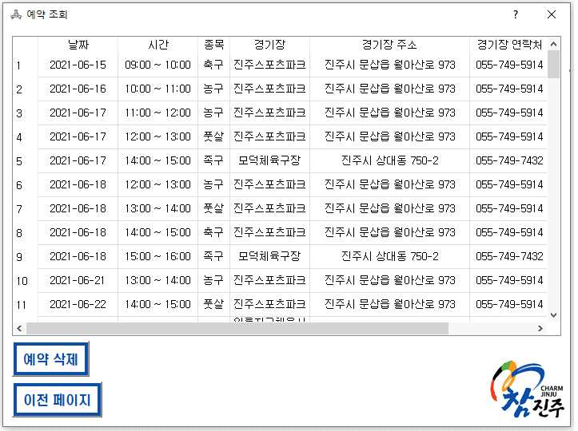

<div id="top"></div>
<!--
*** Thanks for checking out the Best-README-Template. If you have a suggestion
*** that would make this better, please fork the repo and create a pull request
*** or simply open an issue with the tag "enhancement".
*** Don't forget to give the project a star!
*** Thanks again! Now go create something AMAZING! :D
-->


<!-- PROJECT SHIELDS -->
<!--
*** I'm using markdown "reference style" links for readability.
*** Reference links are enclosed in brackets [ ] instead of parentheses ( ).
*** See the bottom of this document for the declaration of the reference variables
*** for contributors-url, forks-url, etc. This is an optional, concise syntax you may use.
*** https://www.markdownguide.org/basic-syntax/#reference-style-links
-->
[![Contributors][contributors-shield]][contributors-url]
[![Forks][forks-shield]][forks-url]
[![Stargazers][stars-shield]][stars-url]
[![Issues][issues-shield]][issues-url]
[![MIT License][license-shield]][license-url]
[![LinkedIn][linkedin-shield]][linkedin-url]


<!-- PROJECT LOGO -->
<br />
<div align="center">
  <h1 align="center">공공 체육 시설 예약 프로그램</h1>
</div>

<!-- TABLE OF CONTENTS -->
<details>
  <summary>Table of Contents</summary>
  <ol>
    <li>
      <a href="#about-the-project">About The Project</a>
      <ul>
        <li><a href="#built-with">Built With</a></li>
      </ul>
    </li>
    <li>
      <a href="#getting-started">Getting Started</a>
      <ul>
        <li><a href="#prerequisites">Prerequisites</a></li>
        <li><a href="#installation">Installation</a></li>
      </ul>
    </li>
    <li><a href="#database">Database</a></li>
    <li><a href="#usage">Usage</a></li>
    <li><a href="#contributing">Contributing</a></li>
    <li><a href="#contact">Contact</a></li>
    <li><a href="#acknowledgments">Acknowledgments</a></li>
  </ol>
</details>


<!-- ABOUT THE PROJECT -->
## About The Project

진주시 내에서 공동 시설로 지정된 체육 시설 예약 방식이 비효율적이라는 의견이 존재한다. 첫 번째 예약 방식은 공동 시설에서 시간을 정해주면 그 시간 대에 선착순으로 와서 예약을 하는 경우이다. 이 방법은  시간, 경제적 비용을 소모해야 한다는 단점이 있다.
두 번째 방법은 전화 예약이다. 그러나 예약자 리스트를 볼 수 없고, 사용자가 교모하게 이름을 바꾸어 예약하는 방법 등으로 독점이 발생할 수 있다.  
이러한 방법들의 단점을 보완하고자 개발한 공공 체육 시설 예약 프로그램이다.<br>
해당 프로그램은 사용자의 독점을 막고, 장소와 시간에 제약 받지 않고 사용할 수 있다.

이 프로그램은 다음과 같은 서비스를 사용자에게 제공하고 있다.
* 예약
* 예약 조회, 취소
* 1시간 전 알림

뿐만 아니라 관리자에게는 다음과 같은 서비스를 제공하고 있다.
* 날짜별 예약자 명단 확인


<p align="right">(<a href="#top">back to top</a>)</p>


### Built With

List frameworks/libraries in my project.

* [Python](https://www.python.org/)
* [SQL Developer](https://en.wikipedia.org/wiki/Oracle_SQL_Developer)
* [Oracle](https://www.oracle.com/kr/index.html)


<p align="right">(<a href="#top">back to top</a>)</p>


<!-- GETTING STARTED -->
## Getting Started

This is an example of how you may give instructions on setting up your project locally.
To get a local copy up and running follow these simple example steps.

### Prerequisites
1. Oracle SQL Developer가 준비되어야 한다.
2. 테이블 스키마에 따라 동일하게 테이블을 생성해야 한다.


### Installation


1. Clone the repo
   ```sh
   git clone https://github.com/myeongju-kim/Public-Sports-Facility-Reservation-Program.git
   ```
2. Install module
   ```sh
   pip install -r requirments.txt
   ```

<p align="right">(<a href="#top">back to top</a>)</p>


<!-- USAGE EXAMPLES -->
## Database
### 1. 요구사항 명세서


### 2. ER 다이어그램


### 3. 테이블 스키마


### 4. 트랜잭션 설계
```database.py
if mode==0:
   csr.close()
   con.commit()
   con.close()
```
mode가 0이라는 것은 INSERT, UPDATE, DELETE 작업을 수행한다는 것이다.
동시에 데이터를 삽입, 삭제하는 경우 문제가 발생할 수 있기 때문에 commit을 하기 전까지 lock에 걸린상태로
임시저장소에 저장하고 commit을 하게 되면 unlock이 되면서 다른 접근 권한을받아서 진행한다.
<p align="right">(<a href="#top">back to top</a>)</p>

## Usage
### 1. 사용자 UI





### 2. 관리자 UI


<p align="right">(<a href="#top">back to top</a>)</p>


<!-- CONTRIBUTING -->
## Contributing

Contributions are what make the open source community such an amazing place to learn, inspire, and create. Any contributions you make are **greatly appreciated**.

If you have a suggestion that would make this better, please fork the repo and create a pull request. You can also simply open an issue with the tag "enhancement".
Don't forget to give the project a star! Thanks again!

1. Fork the Project
2. Create your Feature Branch 
3. Commit your Changes 
4. Push to the Branch
5. Open a Pull Request

<p align="right">(<a href="#top">back to top</a>)</p>


<!-- CONTACT -->
## Contact

mjoo1106@naver.com

<p align="right">(<a href="#top">back to top</a>)</p>


<!-- ACKNOWLEDGMENTS -->
## Acknowledgments

* [Use SQL Developer](https://www.oracle.com/webfolder/technetwork/tutorials/obe/db/11g/r2/prod/appdev/sqldev/sqldev_mngdb/sqldev_mngdb_otn.htm)
* [How to use cx_Oracle](https://cx-oracle.readthedocs.io/en/latest/user_guide/introduction.html)


<p align="right">(<a href="#top">back to top</a>)</p>


<!-- MARKDOWN LINKS & IMAGES -->
<!-- https://www.markdownguide.org/basic-syntax/#reference-style-links -->
[contributors-shield]: https://img.shields.io/github/contributors/othneildrew/Best-README-Template.svg?style=for-the-badge
[contributors-url]: https://github.com/othneildrew/Best-README-Template/graphs/contributors
[forks-shield]: https://img.shields.io/github/forks/othneildrew/Best-README-Template.svg?style=for-the-badge
[forks-url]: https://github.com/othneildrew/Best-README-Template/network/members
[stars-shield]: https://img.shields.io/github/stars/othneildrew/Best-README-Template.svg?style=for-the-badge
[stars-url]: https://github.com/othneildrew/Best-README-Template/stargazers
[issues-shield]: https://img.shields.io/github/issues/othneildrew/Best-README-Template.svg?style=for-the-badge
[issues-url]: https://github.com/othneildrew/Best-README-Template/issues
[license-shield]: https://img.shields.io/github/license/othneildrew/Best-README-Template.svg?style=for-the-badge
[license-url]: https://github.com/othneildrew/Best-README-Template/blob/master/LICENSE.txt
[linkedin-shield]: https://img.shields.io/badge/-LinkedIn-black.svg?style=for-the-badge&logo=linkedin&colorB=555
[linkedin-url]: https://linkedin.com/in/othneildrew

